# Guia do Usuário – GED

Este guia auxilia no uso do sistema **GED (Gerenciamento Eletrônico de Documentos)**.

Quando o sistema for carregado pela primeira vez, o banco de dados será criado e o arquivo de migrations será aplicado automaticamente. Não é necessário executar scripts de banco manualmente.

A **documentação da API** do backend (Swagger) está disponível em **http://localhost:8080/swagger-ui/index.html** quando o backend está em execução. Nessa página é possível consultar todos os endpoints e testar as chamadas (após fazer login, use o botão "Authorize" para informar o token JWT).

---

## Setup Inicial

Para o setup inicial do sistema, abra o navegador e acesse: **http://localhost**

Como o banco de dados está vazio e não há nenhum usuário cadastrado, será exibida a tela de cadastro do primeiro usuário administrador:

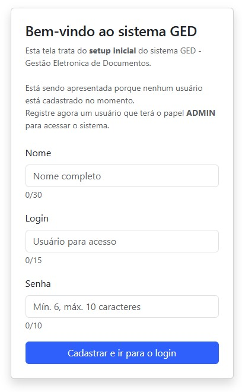

Preencha os campos **Nome**, **Login** e **Senha** para criar o usuário Administrador e clique no botão para prosseguir. Após o cadastro, você será redirecionado para a tela de login.

---

## Login

A tela de login deve ser semelhante à imagem abaixo:

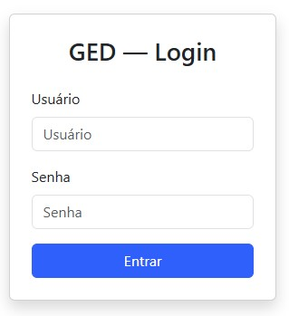

Digite seu **usuário** e **senha** e clique em **Entrar**. Em caso de sucesso, você será levado à tela inicial de documentos.

---

## Cadastro de usuário

A tela de cadastro de usuários deve parecer com a imagem abaixo. Esta funcionalidade está disponível apenas para usuários com perfil **ADMIN**.

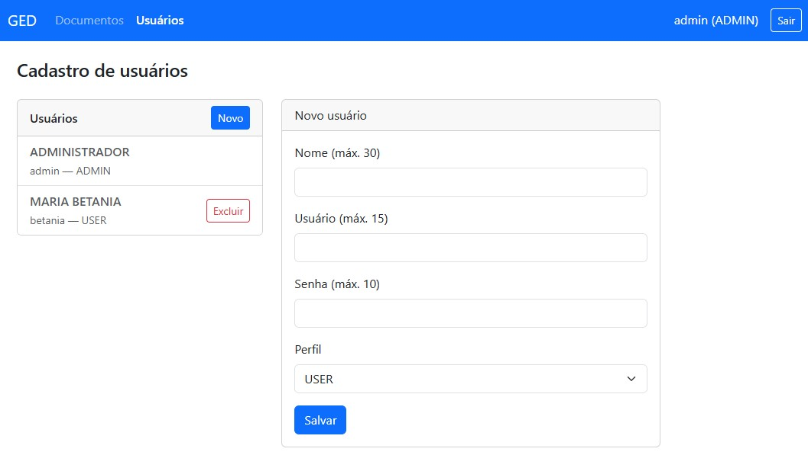

Trata-se de uma SPA (Single Page Application). Do lado esquerdo estão listados os usuários. Ao clicar em um registro, os dados dele são carregados nos campos do formulário à direita.

- **Alterar:** corrija as informações desejadas e clique em **Salvar**.
- **Novo usuário:** clique no botão **Novo** para limpar o formulário. Preencha os dados e clique em **Salvar**. O novo usuário aparecerá na lista à esquerda.
- **Excluir:** o botão **Excluir** remove o usuário selecionado. **Atenção:** ao confirmar a exclusão, todos os documentos que ele tiver criado e todos os arquivos carregados (uploads), inclusive em documentos de outros usuários, serão removidos. No caso de arquivo carregado em documento de terceiros, o documento permanece, mas o arquivo carregado é removido.

**Perfis:**

- Usuário com perfil **USER** pode apenas cadastrar e visualizar documentos.
- Usuário com perfil **ADMIN** pode fazer tudo que o USER faz e, além disso, criar e gerenciar outros usuários.

---

## Cadastro de novo documento

A tela de cadastro de documento é acessada a partir da tela inicial de documentos, clicando no botão **Novo documento**:

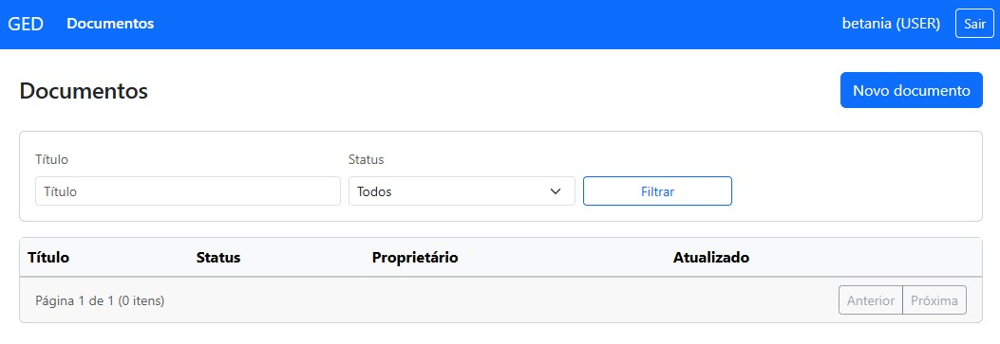

O documento é criado em **duas etapas**.

### Primeira etapa – Dados do documento

Preencha o formulário com título, descrição, tags e status, conforme a imagem:

Se escolher o status **Rascunho**, o documento será visualizado apenas pelo usuário que o criou nas consultas. Após preencher, clique em **Criar**.

### Segunda etapa – Versões e arquivos

Depois de criado, será exibida a tela de detalhe do documento:

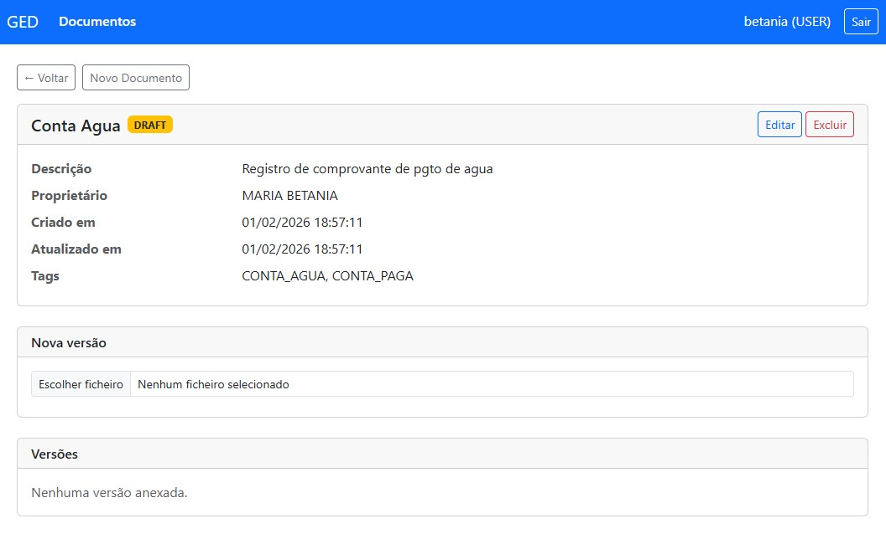

Para carregar um arquivo, clique no botão **Escolher ficheiro**. Em seguida, aparecerá o botão **Enviar**:

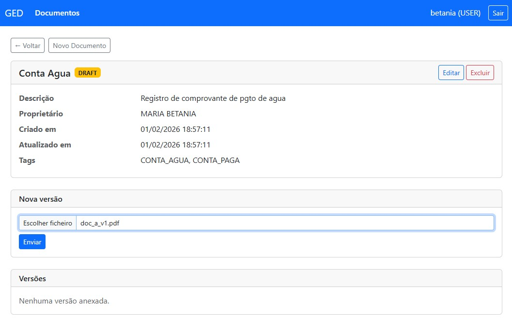

O arquivo carregado aparecerá logo abaixo:

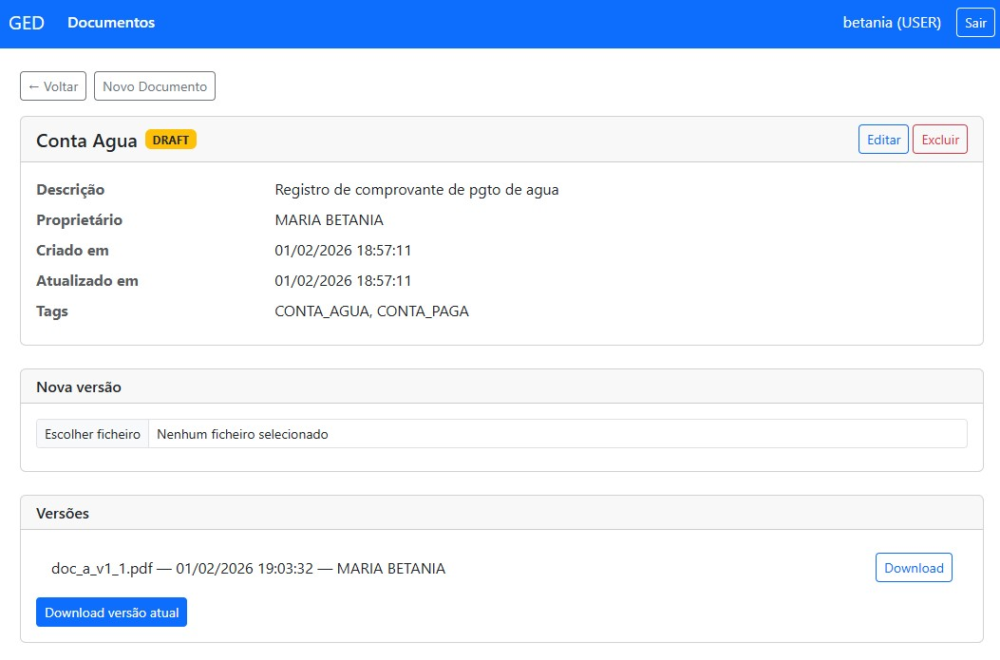

Se você repetir o processo, o novo arquivo será carregado e listado como outra versão:

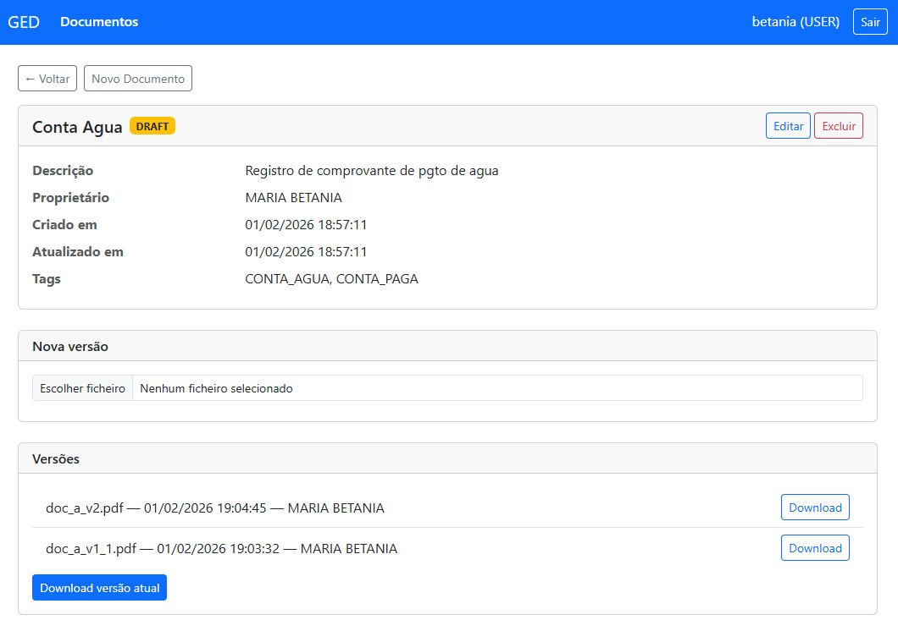

- **Download:** use o botão **Download** ao lado de cada versão para baixar aquela versão do arquivo.
- **Download versão atual:** use esse botão para baixar a versão mais recente (último arquivo carregado).
- **Excluir:** o botão **Excluir**, ao lado do título do documento (junto com **Editar**), remove o registro do documento e os arquivos associados.
- **Editar:** use para atualizar título, descrição, tags e status do documento.

---

## Lista de documentos

A tela de lista de documentos deve ser semelhante à imagem abaixo:

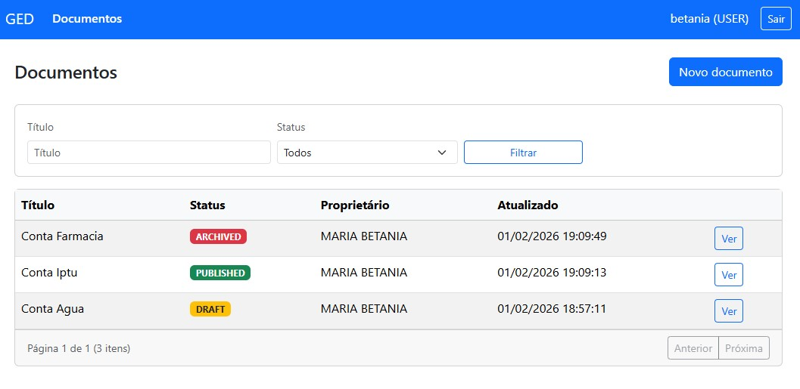

Lembre-se: documentos com status **Rascunho** (Draft) aparecem apenas para o próprio criador.

A pesquisa é feita preenchendo um ou ambos os campos **Título** e **Status** ao lado do botão **Filtrar** e clicando em **Filtrar**.

É possível **ordenar** a lista clicando nos cabeçalhos das colunas **Título**, **Status**, **Proprietário** ou **Atualizado**. O primeiro clique ordena em sentido ascendente; clicando novamente na mesma coluna, a ordenação inverte para descendente. A coluna e a direção atuais são indicadas por uma seta (▲ ou ▼) ao lado do nome da coluna.

Ao entrar com outro usuário, o documento em status Draft não aparece na lista, como na imagem:

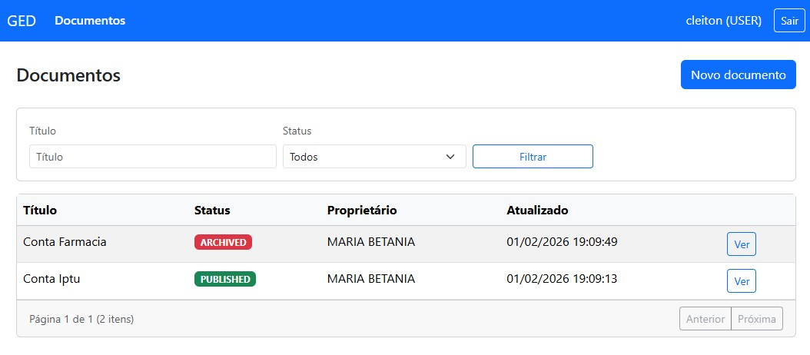

Isso é esperado: para que outros usuários vejam o documento, o criador deve alterar o status para algo diferente de **Rascunho** (por exemplo, Publicado).

Um usuário diferente pode enviar um novo arquivo a um documento já existente, mesmo que o documento tenha sido criado por outro usuário:

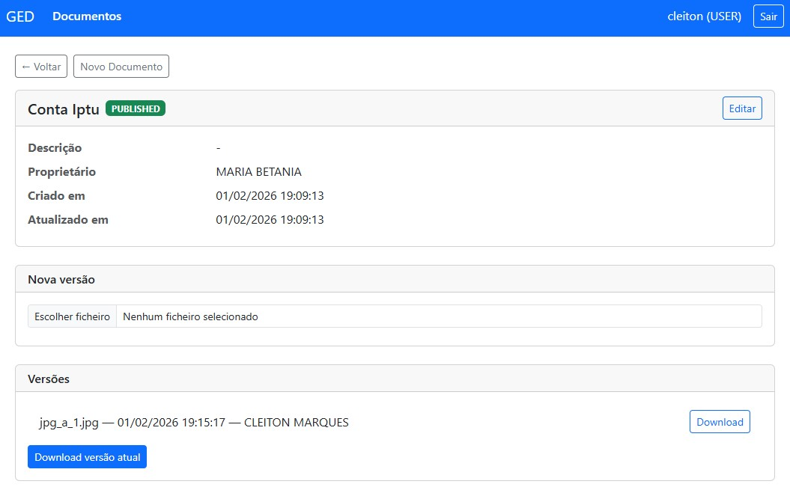

---

## Exclusão de documento

O botão **Excluir** do documento fica disponível apenas para o usuário que criou o documento. Se a exclusão for confirmada, todos os arquivos carregados (inclusive por outros usuários) serão removidos do sistema de arquivos.

A tela de confirmação deve ser semelhante à imagem:

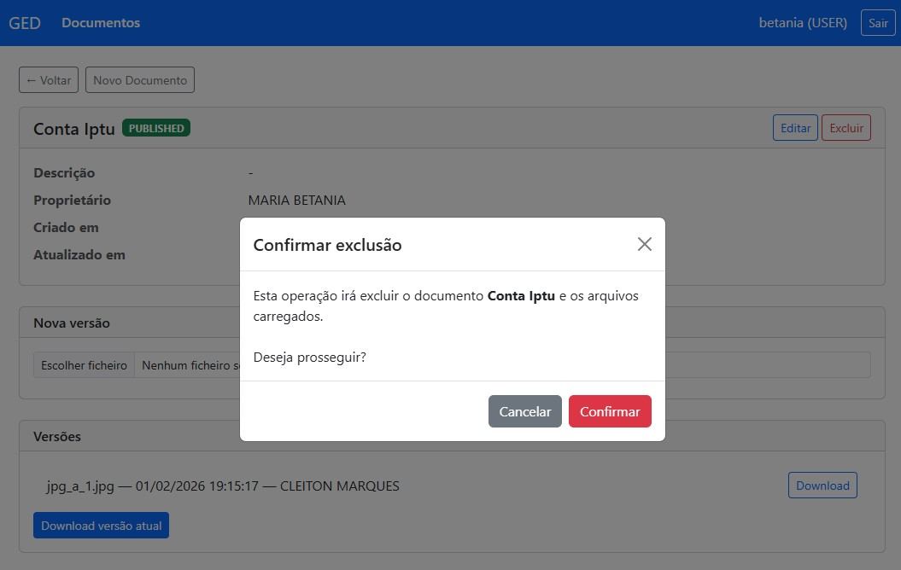

---

## Exclusão de usuário

No cadastro de usuários, ao selecionar um usuário e clicar em **Excluir**, será exibido um diálogo de confirmação:

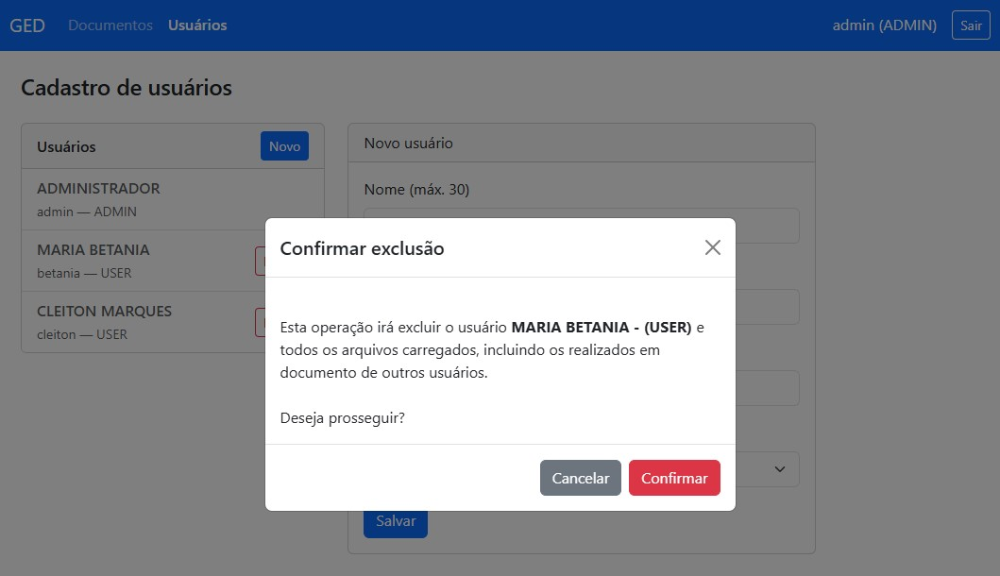

Se confirmado, os documentos criados por esse usuário e os arquivos carregados por ele serão removidos do sistema. Tenha atenção ao excluir usuários que tenham muitos documentos ou uploads associados.
